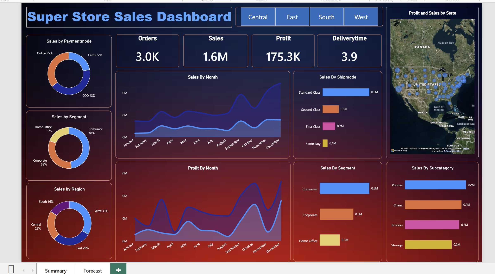
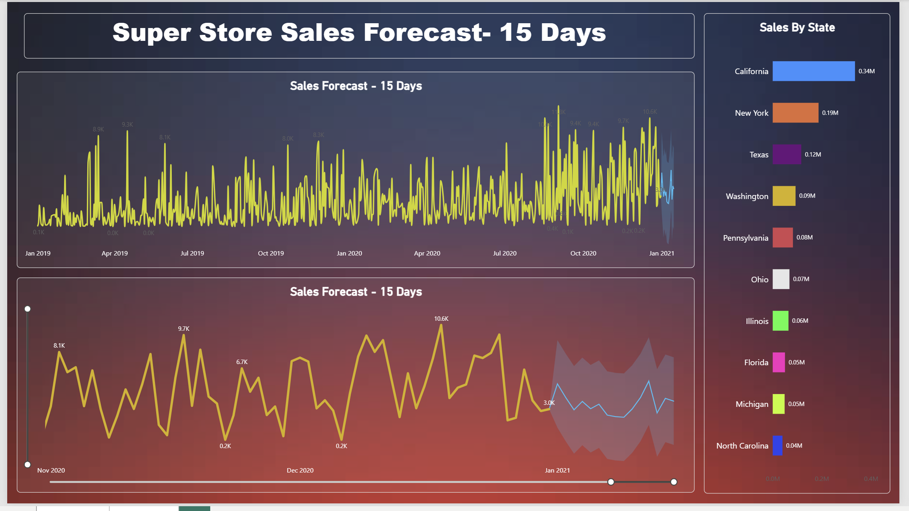

<!--
EDIT BEFORE PUBLISHING:
1. Replace every <PLACEHOLDER> (LinkedIn URL, repo URL, screenshot file names).
2. In "Data Preparation" and "DAX Used", keep only what you actually built in your .pbix.
-->

<div align="center">

# 🛒 Superstore Sales Dashboard
### End-to-end Power BI project: sales, profit, regional performance & 15-day sales forecast


</div>

---

## 📌 Table of Contents
1. [Project Overview](#-project-overview)
2. [Business Questions](#-business-questions)
3. [Dataset](#-dataset)
4. [Tools & Technologies](#-tools--technologies)
5. [Project Workflow](#-project-workflow)
6. [Data Preparation](#-data-preparation)
7. [DAX Used](#-dax-used)
8. [Dashboard Pages](#-dashboard-pages)
9. [Key Findings](#-key-findings)
10. [Recommendations](#-recommendations)
11. [Repository Structure](#-repository-structure)
12. [How to Open This Project](#-how-to-open-this-project)
13. [Author](#-author)

---

## 🎯 Project Overview

This project analyses **5,901 order lines (3,003 orders, 773 customers)** from a US retail Superstore dataset covering **Jan 2019 – Dec 2020**. The Power BI dashboard helps a sales manager see **what is selling, where, and whether it is actually making money**, and it projects the next 15 days of sales.

**Headline numbers**

| Total Sales | Total Profit | Profit Margin | Orders | Avg. Delivery Time |
|:---:|:---:|:---:|:---:|:---:|
| **$1.57M** | **$175.3K** | **11.2%** | **3,003** | **3.9 days** |

---

## ❓ Business Questions

- Which categories, sub-categories and segments drive sales, and which drive **profit**?
- Which regions and states are strong, and which lose money?
- How do sales and profit trend month by month and year by year?
- Which shipping and payment modes are most used?
- What do sales look like over the next 15 days?

---

## 📂 Dataset

| Item | Detail |
|---|---|
| Source | Superstore Sales dataset (Excel) |
| File | `data/SuperStore_Sales_Dataset.xlsx` |
| Size | 5,901 rows × 23 columns |
| Period | 01-Jan-2019 to 31-Dec-2020 |
| Grain | One row per product line within an order |

**Key columns:** Order ID, Order Date, Ship Date, Ship Mode, Customer ID/Name, Segment, Country, City, State, Region, Product ID, Category, Sub-Category, Product Name, Sales, Quantity, Profit, Returns, Payment Mode.

---

## 🧰 Tools & Technologies

| Tool | Purpose |
|---|---|
| **Microsoft Excel** | Source data, quick pivot validation |
| **Power Query** | Data cleaning and transformation |
| **Power BI Desktop** | Data model, visuals, forecasting |
| **DAX** | Calculated columns and measures |
| **GitHub** | Version control and portfolio hosting |

---

## 🔄 Project Workflow


---

## 🧹 Data Preparation

Steps performed in Power Query:

1. Loaded `SuperStore_Sales_Dataset` sheet from Excel.
2. Cleaned the malformed first column header to a proper **Row ID**.
3. Removed the empty columns **ind1** and **ind2** (100% blank).
4. Set correct data types (dates, decimals, whole numbers, text).
5. Handled **Returns** (blank for non-returned lines, `1` for returned lines).
6. Checked for duplicates and nulls (no fully duplicated rows found).
7. Created a **Date Hierarchy** (Year, Quarter, Month, Day) for time analysis.

---

## 🧮 DAX Used

```DAX
-- Calculated column: days taken to deliver an order line
AverageDelivery =
DATEDIFF ( 'SuperStore_Sales_Dataset'[Order Date],
           'SuperStore_Sales_Dataset'[Ship Date], DAY )

-- Core measures
Total Sales    = SUM ( 'SuperStore_Sales_Dataset'[Sales] )
Total Profit   = SUM ( 'SuperStore_Sales_Dataset'[Profit] )
Total Orders   = DISTINCTCOUNT ( 'SuperStore_Sales_Dataset'[Order ID] )
Total Quantity = SUM ( 'SuperStore_Sales_Dataset'[Quantity] )

Profit Margin % =
DIVIDE ( [Total Profit], [Total Sales], 0 )

Avg Delivery Days =
AVERAGE ( 'SuperStore_Sales_Dataset'[AverageDelivery] )

-- Year-over-year growth
Sales LY =
CALCULATE ( [Total Sales], SAMEPERIODLASTYEAR ( 'Calendar'[Date] ) )

Sales YoY % =
DIVIDE ( [Total Sales] - [Sales LY], [Sales LY] )
```

| Function | Used for |
|---|---|
| `SUM`, `AVERAGE` | Sales, profit, quantity, delivery time |
| `DISTINCTCOUNT` | Unique order count |
| `DIVIDE` | Safe profit margin calculation |
| `DATEDIFF` | Delivery time in days |
| `CALCULATE` | Context-modified measures |
| `SAMEPERIODLASTYEAR` | Year-over-year comparison |

---

## 📊 Dashboard Pages

### Page 1: Summary
- **KPI cards:** Orders, Sales, Profit, Delivery Time
- **Region slicer** to filter the whole page
- **Sales by Sub-Category**, **Segment**, **Ship Mode** (bar charts)
- **Sales by Payment Mode**, **Region** and **Segment** (donut charts)
- **Sales and Profit by Month** (stacked area, split by year)
- **Profit and Sales by State** (map)

- 


### Page 2: Sales Forecast (15 Days)
- Daily sales line chart with Power BI's built-in **forecast** (95% confidence band)
- **Sales by State** bar chart

- 


---

## 🔍 Key Findings

### 1. Growth is strong, but profit is not keeping up
| Year | Sales | Profit | Margin |
|---|---:|---:|---:|
| 2019 | $564.7K | $81.8K | **14.5%** |
| 2020 | $1,001.1K | $93.4K | **9.3%** |

Sales grew **+77%** in 2020 but profit grew only **+14%**, so the margin fell by about 5 points.

### 2. Technology earns the profit; Furniture barely does
| Category | Sales | Profit | Margin |
|---|---:|---:|---:|
| Technology | $470.6K | $90.5K | **19.2%** |
| Office Supplies | $643.7K | $74.8K | 11.6% |
| Furniture | $451.5K | $10.0K | **2.2%** |

Furniture brings in almost as much revenue as Technology but only about 11% of its profit.

### 3. Three sub-categories lose money
- **Tables:** −$11.1K (−9.3% margin) despite $119K in sales
- **Supplies:** −$1.7K
- **Bookcases:** −$0.3K
- On the other side, **Copiers** return a **71.6%** margin ($42.8K profit), with Accessories and Paper near 21%.

### 4. Texas, Illinois, Ohio, Pennsylvania and Colorado are loss-making
| State | Sales | Profit |
|---|---:|---:|
| Texas | $116.3K | **−$14.1K** |
| Illinois | $64.2K | −$9.6K |
| Ohio | $68.2K | −$9.3K |
| Pennsylvania | $82.4K | −$9.3K |
| Colorado | $29.2K | −$5.8K |

By contrast, **California** ($335K sales, $49.4K profit) and **New York** ($186.7K sales, $41.0K profit, 22% margin) lead the country.

### 5. Region view
**West** is the best performer ($522K sales, 13.0% margin). **Central** is the weakest on margin at **8.0%**.

### 6. Sales are highly seasonal
- Peak months: **December ($245K), November ($210K), September ($193K)**
- Slowest months: **January ($73K) and February ($72K)**
- **Q4 alone contributes ~37.5%** of total sales.

### 7. Customer, shipping and payment behaviour
- **Consumer** segment makes up **48%** of sales; Home Office has the best margin (11.9%).
- **Standard Class** carries **58%** of sales; **Same Day** has the lowest margin (9.2%).
- **COD** is the most used payment mode (43% of sales); **Online** has the lowest margin (9.8%).
- Average delivery time is **3.9 days**.

### 8. Losses and returns
- **1,098 of 5,901 order lines (18.6%)** are loss-making, totalling **−$91.7K**.
- **34% of Furniture lines** lose money, versus about 14–15% for the other categories.
- **287 returned lines** worth **$88.4K** (**5.6% of sales**).

---

## 💡 Recommendations

1. **Review discounting and pricing on Tables, Supplies and Bookcases.** These lines are sold at a loss.
2. **Investigate Texas, Illinois, Ohio, Pennsylvania and Colorado** (shipping cost, discount levels, product mix).
3. **Push high-margin products** such as Copiers, Accessories and Paper in marketing and bundles.
4. **Plan inventory and staffing for Q4**, and run promotions in Jan–Feb to smooth demand.
5. **Protect margin while scaling.** Track profit margin next to sales growth on every report.
6. **Look into return reasons**, since returns remove about 5.6% of revenue.

---

## 🗂 Repository Structure

```
superstore-sales-powerbi-dashboard/
│
├── 📁 data/
│   └── SuperStore_Sales_Dataset.xlsx
├── 📁 powerbi/
│   └── Store_Sales_data_Analysis.pbix
├── 📁 images/
│   ├── 01_summary_dashboard.png
│   └── 02_forecast_dashboard.png
├── 📄 README.md
└── 📄 .gitignore
```

---

## ▶️ How to Open This Project

1. Clone the repo
   ```bash
   git clone https://github.com/<YOUR-USERNAME>/superstore-sales-powerbi-dashboard.git
   ```
2. Install the free [Power BI Desktop](https://powerbi.microsoft.com/desktop/).
3. Open `powerbi/Store_Sales_data_Analysis.pbix`.
4. If Power BI asks for the data source, go to **Home → Transform data → Data source settings** and point it to `data/SuperStore_Sales_Dataset.xlsx` on your machine.

---

## 👤 Author

**Neeraj Singh Bora (Neeru)**
Lead Associate|R1 RCM | RCM Professional moving into Data Analytics


⭐ If you found this project useful, please star the repo!
